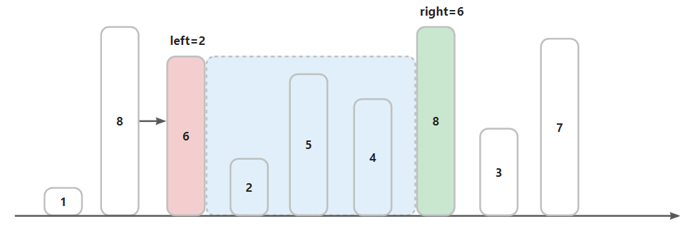

## 盛最多水的容器
### 题目
给定一个长度为 n 的整数数组 height 。有 n 条垂线，第 i 条线的两个端点是 (i, 0) 和 (i, height[i]) 。

找出其中的两条线，使得它们与 x 轴共同构成的容器可以容纳最多的水。

返回容器可以储存的最大水量。

**说明：你不能倾斜容器。**

### 示例


```
示例 1：
输入：[1,8,6,2,5,4,8,3,7]
输出：49
解释：图中垂直线代表输入数组 [1,8,6,2,5,4,8,3,7]。在此情况下，容器能够容纳水（表示为蓝色部分）的最大值为 49。

示例 2：
输入：height = [1,1]
输出：1
```

### 解题思路--双指针
1. 初始化定义两个指针`left=0`，`right=nums.length-1`，计算面积。

   

    `S = min(nums[left],nums[right]) × (right−left) = 1×8 = 8`
2. 移动指针：`left < right`， `right++`。

   

   `S = min(nums[left],nums[right]) × (right−left) = 7 × 7 = 49`
3. 以此类推，哪个指针小，就向中间移动。
4. 当`nums[left] == nums[right]`时，`left++`。

   

   `S=min(nums[left],nums[right])×(right−left) = 6 × 2 = 24`
5. 结束条件：当`left == right`时，就结束移动。

   

### 伪代码
```
int left = 0                    # The left pointer at the beginning
int right = nums.length - 1     # The right pointer at the end 
int S = 0                       # Variable to store the current area
int maxArea = 0                  # Variable to store the maximum area

while left < right:
    # Calculate the current area
    S = min(nums[left], nums[right]) * (right - left)
    
    # Update the maximum area if the current area is greater
    maxArea = max(maxArea, S)

    # Move the pointers towards each other
    if nums[left] < nums[right]:
        left += 1
    else:
        right -= 1

# Return the maximum area
return maxArea
```

### 复杂度

1. 时间复杂度：`O(n)`。
   - 左指针和右指针会在中间相遇就i停止循环，因此每个指针最多移动n次。
2. 空间复杂度：`O(1)` 。
   - left、right、S、res都是常量

**Code：**

```java
class Solution {
    public int maxArea(int[] height) {
        // Initialize two pointers, 'left' at the beginning and 'right' at the end.
        int right = height.length - 1;
        int left = 0;

        // Initialize variables to store the maximum and current area.
        int maxArea = 0;
        int currentArea = 0;

        // Iterate until the two pointers meet.
        while (left < right) {
            // Calculate the current area based on the minimum height and width.
            currentArea = Math.min(height[left], height[right]) * (right - left);

            // Update the maximum area if the current area is greater.
            maxArea = Math.max(currentArea, maxArea);

            // Move the pointers towards each other, focusing on the higher side.
            if (height[left] <= height[right]) {
                left++;
            } else {
                right--;
            }
        }

        // Return the maximum area obtained.
        return maxArea;
    }
}
```
