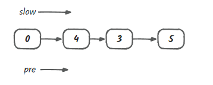
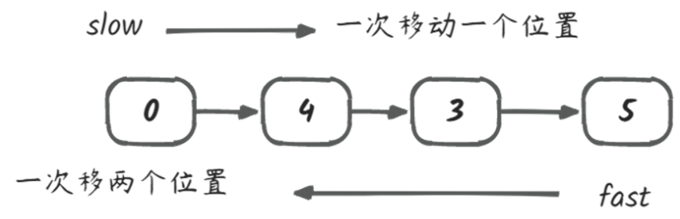

在计算机科学和编程中，双指针法（Two Pointers）是一种强大的技术，常用于解决各种算法问题。这种方法通常涉及使用两个指针（索引或引用），它们在序列中以不同的速度移动或遍历，以解决特定类型的问题。无论是处理数组、链表还是字符串，双指针技术都能发挥出色的作用。
## 分类
### 普通指针
定义两个指针同时向同一个方向移动。

### 左右指针

左右指针指向数组或字符串中的不同位置，通过在两端同时移动来解决问题。
在**解决搜索**、**排序**和区间相关问题时非常有用。

### 快慢指针
快慢指针是双指针法的一种基本形式，其中一个指针移动速度比另一个快。
在处理链表问题时，快慢指针经常用于**检测环**或找到中间节点。

## 应用场景
### 链表问题

- **检测环**：使用快慢指针检测链表中是否存在循环。
- **寻找中间节点**：快慢指针同时移动，快指针到达末尾时，慢指针指向中间节点。
- 
### 数组与字符串问题

- **两数之和**：使用左右指针在有序数组中寻找两个数之和。
- **反转数组或字符串**：使用双指针交换元素完成反转操作。
- **滑动窗口**：通过左右指针定义窗口，在数组或字符串上滑动寻找特定条件的子串。
- 
## 总结
双指针技术是解决算法问题的强大工具，能够有效地解决各种数据结构和算法中的难题。其优势在于简洁高效，常常能够在 $O(N)$ 的时间复杂度内完成任务。熟练掌握双指针方法，并能根据不同问题变体灵活运用，将极大地提升编程能力和解决问题的效率。
