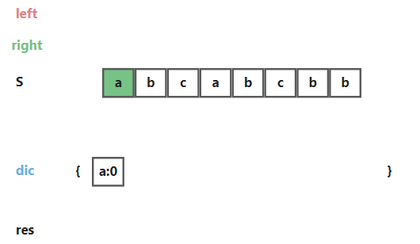
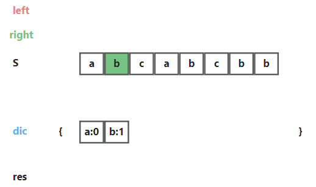
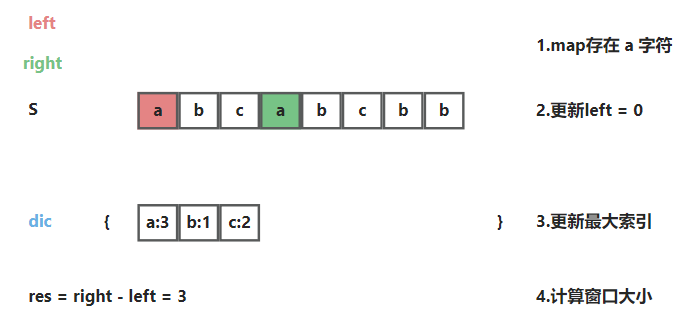
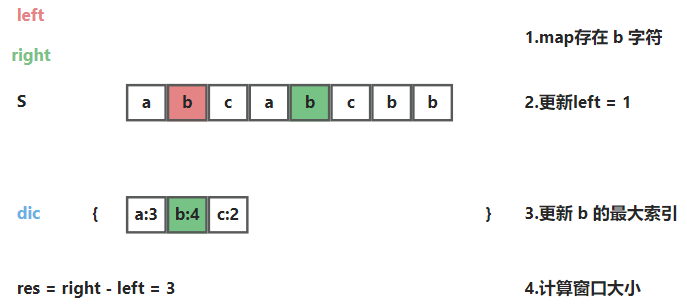
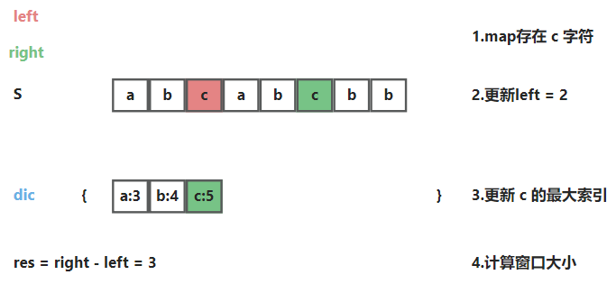
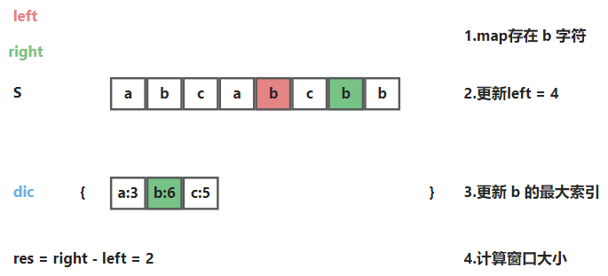
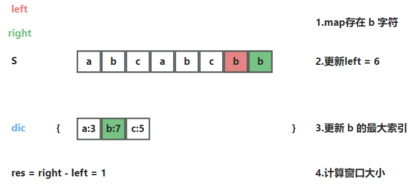

## 无重复字符的最长子串

### 题目

给定一个字符串 s ，请你找出其中不含有重复字符的 **最长子串** 的长度。


### 示例

```
示例 1:
输入: s = "abcabcbb"
输出: 3 
解释: 因为无重复字符的最长子串是 "abc"，所以其长度为 3。

示例 2:
输入: s = "bbbbb"
输出: 1
解释: 因为无重复字符的最长子串是 "b"，所以其长度为 1。

示例 3:
输入: s = "pwwkew"
输出: 3
解释: 因为无重复字符的最长子串是 "wke"，所以其长度为 3。
     请注意，你的答案必须是 子串 的长度，"pwke" 是一个子序列，不是子串。
```

###  解题思路--滑动窗口+哈希表
1. 将字符串转为字符数组。
2. 定义双指针，`left`和`right`，同时向右边移动。
3. `right`：扩大窗口，并将每个元素存储到`map <字符，最大索引>`哈希表。
4. 当遇到相同的`left = map.get(right)的最大索引`
5. 计算窗口的大小。


###  算法推导

1. `right`向右移动，扩大窗口，`map`存储每个字符的`最大索引`。
    
   
   
   
   
   `right`持续向右移动......

   
   
2. 此时，子序列存在重复字符`a`，`left`向右移动，缩小窗口，计算子序列长度`res = 3`。
   
   `right`持续向右移动......
   
   

3. 此时，子序列存在重复字符`b`，`left`向右移动，缩小窗口，计算子序列长度`res = 3`。

   

4. 此时，子序列存在重复字符`c`，`left`向右移动，缩小窗口，计算子序列长度`res = 3`。
   
   

5. 此时，子序列存在重复字符`b`，`left`向右移动，缩小窗口，计算子序列长度`res = 2`。

   

6. 返回最大`res`。


###  伪代码
```
Function (){}

// 哈希表
Map<Character, Integer> map = new HashMap<>();  

int left = -1;
int res = 0;
int tmp = 0;

// 遍历数组
for (int right = 0; right < s.length(); right++) {
   // 存在相同的元素
   if(map.containsKey(s[right])){
      left = Math.max(left, map.get(s[right]));
   }
   
   // 添加或更新元素
   map.put(s[right], right);
   // 计算最大长度
   res = Math.max(res, right - left);
}
```


### 复杂度
 - 时间复杂度：O(N)。
 - 空间复杂度：O(1) 
   - 字符的 ASCII 码范围为`0 ~ 127` ，哈希表`map`最多使用`O(128)=O(1)`大小的额外空间。


### Code
```java
class Solution {
    public int lengthOfLongestSubstring(String s) {
        //滑动窗口
        if(s.length()==0){   //空字符串
            return 0;
        }
        //1、将s字符串拆分为数组
        char[] charArray=s.toCharArray();
        //2、初始化变量
        int left=-1;
        int max=0;
        HashMap<Character,Integer> map=new HashMap<Character,Integer>();
        //3、循环
        for(int right=0;right<s.length();right++){
            if(map.containsKey(charArray[right])){   //哈希表中存在重复
                left=Math.max(left,map.get(charArray[right]));   
            }

            map.put(charArray[right],right);   //更新哈希表数据 
            max=Math.max(max, right - left);  //更新结果
        }
        return max;
    }
}
```