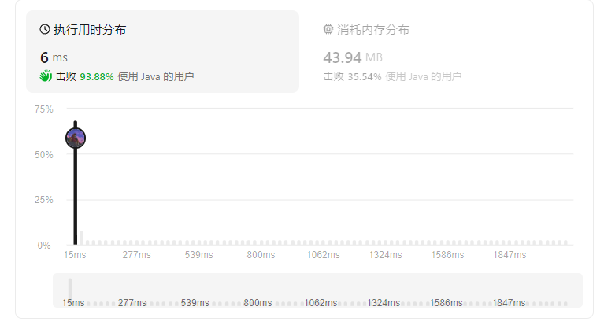

## 找到字符串中所有字母异位词

给定两个字符串 s 和 p，找到 s 中所有 p 的 异位词 的子串，返回这些子串的起始索引。不考虑答案输出的顺序。

异位词 指由相同字母重排列形成的字符串（包括相同的字符串）。

## 示例
```
示例 1:
输入: s = "cbaebabacd", p = "abc"
输出: [0,6]
解释:
起始索引等于 0 的子串是 "cba", 它是 "abc" 的异位词。
起始索引等于 6 的子串是 "bac", 它是 "abc" 的异位词。

 示例 2:
输入: s = "abab", p = "ab"
输出: [0,1,2]
解释:
起始索引等于 0 的子串是 "ab", 它是 "ab" 的异位词。
起始索引等于 1 的子串是 "ba", 它是 "ab" 的异位词。
起始索引等于 2 的子串是 "ab", 它是 "ab" 的异位词。
```

##  解题思路--滑动窗口
1. 设置滑动窗口的大小和`p`字符串的长度相同
2. 统计窗口的子串中每个字符的出现次数是否和`p`相同。
   - 相同：将`left`添加到`res`集合。
   - 不相同：`left++，right++`，继续向前移动。

###  算法推导


###  伪代码
```
int sLen = s.length();   // s 的长度
pLen = p.length();       // p 的长度
char[] arr = s.toCharArray();  //将字符串转为字符数组。
List<Integer> res = new ArrayList<>();  // 结果。
int[] cnt = new int[26];  // 统计词频，判断窗口字符是否等于 p。

// p 字符数组的词频。
int[] pCnt = new int[26];
for(char c : p.toCharArray()) pCnt[c - 'a']++;

// 滑动窗口
int left = 0;
for(int right = 0; right < sLen; right++){
   // right 向右滑动，统计词频
   while(right - left < pLen){
      cnt[right - 'a']++;   
   }
   // 判断统计词频是否等于 p 的词频
   if (check(cnt, pCnt)) res.add(i);
   // left向右移动，去除前一个字符。
   cnt[left - 'a']--;   
   left++;
   
}
// 判断词频数组是否相同。
Function check(int[] c1, int[] c2) {
   if (c1.length != c2.length) return false;
   for (int i = 0; i < c1.length; i++) {
      if (c1[i] != c2[i]) return false;
   }
   return true;
}
```

### 复杂度
- 时间复杂度: O(n)
- 空间复杂度: O(1)



### Code
```java
class Solution {
    public List<Integer> findAnagrams(String s, String p) {
        int sLen = s.length(); // s 的长度
        int pLen = p.length(); // p 的长度
        
        char[] arr = s.toCharArray(); // 将字符串转为字符数组。
        List<Integer> res = new ArrayList<>(); // 结果。
        int[] cnt = new int[26]; // 统计词频，判断窗口字符是否等于 p。

        // p 字符数组的词频。
        int[] pCnt = new int[26];
        for (char c : p.toCharArray()) pCnt[c - 'a']++;

        // 滑动窗口
        int left = 0;
        for (int right = 0; right < sLen; right++) {
            // right 向右滑动，统计词频
            cnt[arr[right] - 'a']++;

            // 当窗口大小等于 p 的长度时
            if (right - left + 1 == pLen) {
                // 判断统计词频是否等于 p 的词频
                if (check(cnt, pCnt)) res.add(left);

                // left 向右移动，去除前一个字符。
                cnt[arr[left] - 'a']--;
                left++;
            }
        }
        return res;
    }

    // 判断词频数组是否相同。
    boolean check(int[] c1, int[] c2) {
        if (c1.length != c2.length) return false;
        for (int i = 0; i < c1.length; i++) {
            if (c1[i] != c2[i]) return false;
        }
        return true;
    }
}

```


