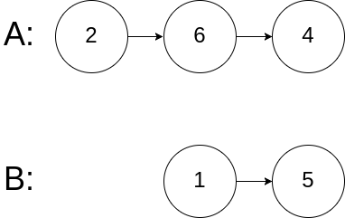
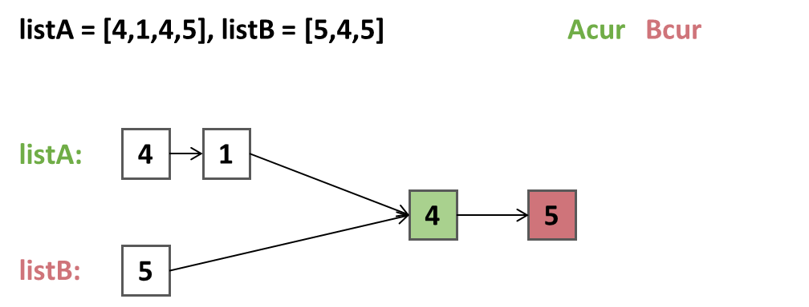

## 链表相交
给你两个单链表的头节点 headA 和 headB ，请你找出并返回两个单链表相交的起始节点。如果两个链表不存在相交节点，返回 null 。

图示两个链表在节点 c1 开始相交：


题目数据 保证 整个链式结构中不存在环。

注意，函数返回结果后，链表必须 保持其原始结构 。

## 示例


```
示例 1：
输入：intersectVal = 8, listA = [4,1,8,4,5], listB = [5,6,1,8,4,5], skipA = 2, skipB = 3
输出：Intersected at '8'
解释：相交节点的值为 8 （注意，如果两个链表相交则不能为 0）。
    从各自的表头开始算起，链表 A 为 [4,1,8,4,5]，链表 B 为 [5,6,1,8,4,5]。
    在 A 中，相交节点前有 2 个节点；在 B 中，相交节点前有 3 个节点。

请注意相交节点的值不为 1，因为在链表 A 和链表 B 之中值为 1 的节点 (A 中第二个节点和 B 中第三个节点) 是不同的节点。
换句话说，它们在 内存 中指向两个不同的位置，而链表 A 和链表 B 中值为 8 的节点 (A 中第三个节点，B 中第四个节点) 在内存中指向相同的位置。
```



```
示例 3：
输入：intersectVal = 0, listA = [2,6,4], listB = [1,5], skipA = 3, skipB = 2
输出：null
解释：从各自的表头开始算起，链表 A 为 [2,6,4]，链表 B 为 [1,5]。

由于这两个链表不相交，所以 intersectVal 必须为 0，而 skipA 和 skipB 可以是任意值。
这两个链表不相交，因此返回 null 。
```


***


## 解题思路--哈希表
1. 定义一个哈希集合`set`，用于存储链表`A`中**每个节点**。
2. 遍历`A`链表，将节点存储到`set`中。
3. 再遍历`B`链表，当`set`中存在该节点（**判断的是节点的内存地址**），就直接返回。

### 算法推导


### 伪代码
```
HashSet<ListNode> set = new HashSet();

// 遍历 A 链表
ListNode Acur = headA;
while(Acur != null){
    set.add(Acur);
}
// 遍历 B 链表
ListNode Bcur = headB;
while(Bcur != null){
    if(Bcur != null && set.contains(Bcur)){
        return Bcur;
    }
    Bcur = Bcur.next;
}

// 链表不相交
return null;
```


### 复杂度
- 时间复杂度：O(m+n)，其中 m 和 n 分别为链表 A 和 B 的长度。
- 空间复杂度：O(m+n)，其中 m 和 n 分别为链表 A 和 B 的长度。


### Code
```java
/**
 * Definition for singly-linked list.
 * public class ListNode {
 *     int val;
 *     ListNode next;
 *     ListNode(int x) {
 *         val = x;
 *         next = null;
 *     }
 * }
 */

public class Solution {
    public ListNode getIntersectionNode(ListNode headA, ListNode headB) {
        Set<ListNode> set = new HashSet<ListNode>();
        ListNode Acur = headA;
        while (Acur != null) {
            set.add(Acur);
            Acur = Acur.next;
        }
        Bcur = headB;
        while (Bcur != null) {
            if (set.contains(temp)) {
                return Bcur;
            }
            Bcur = Bcur.next;
        }
        return null;
    }
}
```


***


## 解题思路--双指针
1. 定义`Acur`和`Bcur`分别遍历`A`链表和`B`链表。
2. 当`Acur`遍历完`A`链表时，将`Acur`指向`B`的头节点，继续遍历`B`链表。
3. 当`Bcur`遍历完`B`链表时，将`Bcur`指向`A`的头节点，继续遍历`A`链表。
4. 最终当`Acur`和`Bcur`指向同一个节点时，返回该节点。
5. 反之，返回`null`。


### 算法推导


1. `Acur`指针和`Bcur`开始分别链表`A`和`B`的头节点。
    
    
    
    
    
    
2. 此时，找到链表的相交点。

    


### 伪代码
1. 定义`Acur`和`Bcur`指针
2. 使用`while(Acur != Bcur)`循环遍历`A`链表和`B`链表。
```
ListNode Acur = A, Bcur = B;
// 遍历
while(Acur != Bcur){
    // Acur指针
    if(Acur != null){
        Acur = Acur.next;   // Acur向前移动
    }else{
        Acur = B;           // 遍历完，继续遍历B链表。
    }
    
    // Bcur指针
    if(Bcur != null){
        Bcur = Bcur.next;
    }else{
        Bcur = A;
    }
}

```

### 复杂度
- 时间复杂度：O(n)
- 空间复杂度：O(1)


### Code
```java
/**
 * Definition for singly-linked list.
 * public class ListNode {
 *     int val;
 *     ListNode next;
 *     ListNode(int x) {
 *         val = x;
 *         next = null;
 *     }
 * }
 */

public class Solution {
    public ListNode getIntersectionNode(ListNode headA, ListNode headB) {
        ListNode A = headA, B = headB;

        while (A != B) {
            A = A != null ? A.next : headB;
            B = B != null ? B.next : headA;
        }
        return A;
    }
}
```