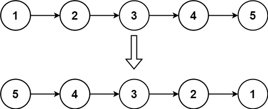
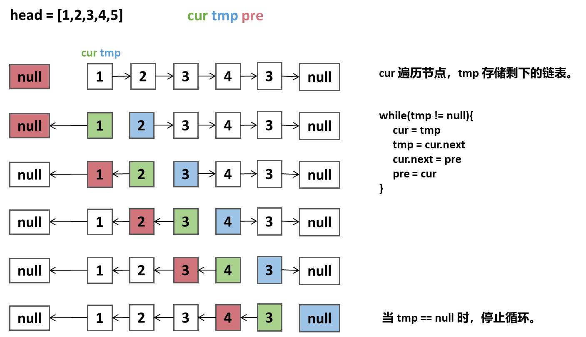
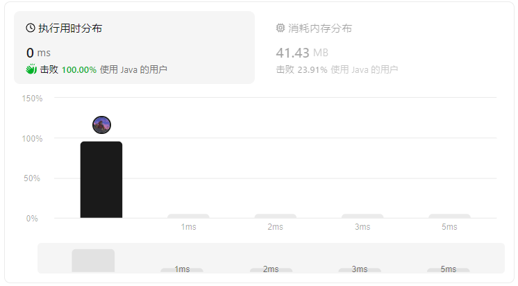

## 链表反转
给你单链表的头节点 head ，请你反转链表，并返回反转后的链表。

## 示例



```
示例1：
输入：head = [1,2,3,4,5]
输出：[5,4,3,2,1]


示例 2：
输入：head = []
输出：[]
```


### 解题思路--双指针
1. 定义三个指着：`pre`, `cur`, `next`。
2. `pre`指向`head`，`cur`指向`head.next`，`next`指向`cur.next`。

### 算法推导



### 伪代码
```
ListNode pre = null;
ListNode cur = head;
ListNode tmp = head;

// 遍历链表
while(tmp != null){
    cur = tmp;
    tmp = cur.next;    // 暂存临时链表
    cur.next = pre;    // 节点反转
    pre = cur;         // pre指针向前移动
}
```

### 复杂度
- 时间复杂度：O(n)
- 空间复杂度：O(1)
  


### Code
```java
class Solution {
    public ListNode reverseList(ListNode head) {
        ListNode pre = null;
        ListNode tmp = head;
        ListNode cur = head;
        while(tmp != null){
            cur = tmp;
            tmp = cur.next;
            cur.next = pre;
            pre = cur;
        }
        return cur;
    }         
}
```
