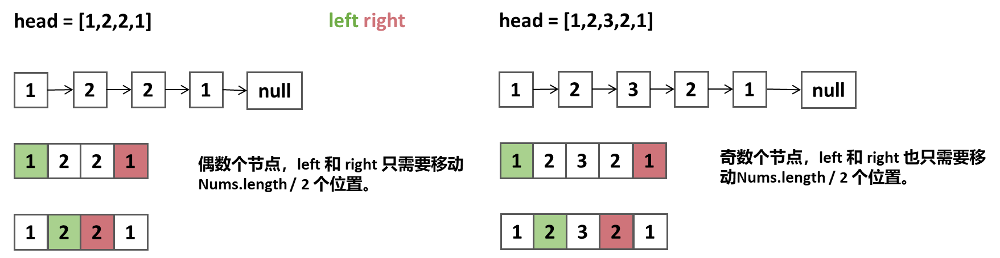

## 回文链表
给你一个单链表的头节点 head ，请你判断该链表是否为回文链表。

如果是，返回 true ；否则，返回 false 。
## 示例


```
示例1：
输入：head = [1,2,2,1]
输出：true
```


```
示例2：
输入：head = [1,2]
输出：false
```

## 解题思路--双指针
1. 遍历链表，将链表中的节点保存到一个数组中。
2. 定义两个指针：`left`和`right`，
3. 初始时，`left`指向数组的第一个元素，`right`指向数组的最后一个元素。
4. 两个指针同时想中间元素移动，
   - 如果`nums[left] != nums[right]`，则返回`false`。
   - 反之，返回`true`。

### 算法推导



### 伪代码
```
List<Integer> arr = new ArrayList<>();
//遍历节点存储到数组
ListNode tmp = head;
while(tmp != null){
   arr.add(tmp.val);
   tmp = tmp.next;
}

// 初始化指针
int left = 0;
int right = arr.size() - 1;
for(int i = 0; i < arr.size() / 2; i++){
   if(arr.get(left++) == arr.get(right--))  return false;
}
return true;
```

### 复杂度
- 时间复杂度：O(n)
- 空间复杂度：O(n)


### Code
```java
class Solution {
    public boolean isPalindrome(ListNode head) {
        List<Integer> arr = new ArrayList<>();

        //遍历链表，存储到数组
        while(head!=null){
            arr.add(head.val);
            head = head.next;
        }
            
        // 双指针遍历数组
        int left = 0;
        int right = arr.size()-1;
        for(int i=0; i<arr.size()/2; i++){
            if(arr.get(left++) != arr.get(right--)){
                return false;
            }
        }

        return true;
    }
}
```