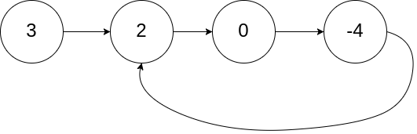
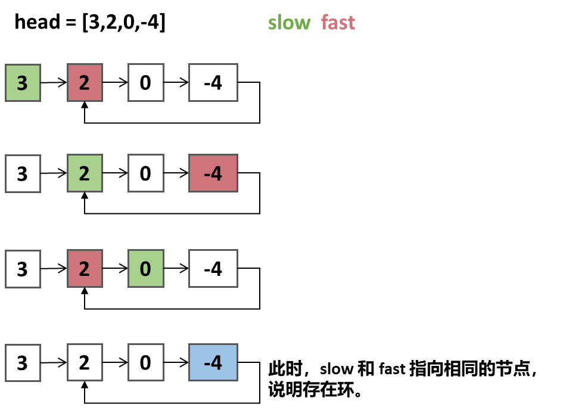

## 环形链表

给你一个链表的头节点 head ，判断链表中是否有环。

如果链表中有某个节点，可以通过连续跟踪 next 指针再次到达，则链表中存在环。 
为了表示给定链表中的环，评测系统内部使用整数 pos 来表示链表尾连接到链表中的位置（索引从 0 开始）。注意：pos 不作为参数进行传递 。
仅仅是为了标识链表的实际情况。

如果链表中存在环 ，则返回 true 。 否则，返回 false 。
## 示例


```
示例1：
输入：head = [3,2,0,-4], pos = 1
输出：true
解释：链表中有一个环，其尾部连接到第二个节点。
```


```
示例2：
输入：head = [1], pos = -1
输出：false
解释：链表中没有环。
```

***

## 解题思路--快慢指针
1. 定义快慢指针：`slow`和`fast`
2. `slow`指针每次移动 1 步，`fast`指针每次移动 2 步。
3. 如果链表存在环，`fast`肯定会追上`slow`指针，即`fast == slow`。

### 算法推导




### 伪代码
```
// 校验
if(head == null || head.next == null){
    return false;
}
ListNode slow = head;
ListNode fast = head.next;

// 遍历
while (fast != null && fast.next != null) {
    slow = slow.next;
    fast = fast.next.next;
    if(slow == fast){
        return true;
    }
}
return false;
```


### 复杂度
- 时间复杂度：O(n)
- 空间复杂度：O(1)


###  Code
```java
public class Solution {
    public boolean hasCycle(ListNode head) {
        if (head == null || head.next == null) {
            return false;
        }

        ListNode slow = head;     //慢指针
        ListNode fast = head.next;     //快指针

        //遍历链表
        while (fast != null && fast.next != null) {
            slow = slow.next; // 慢指针移动一步
            fast = fast.next.next; // 快指针移动两步
            if (slow == fast) {
                return true; // 快慢指针相遇，存在循环
            }
        }
        return false;
    }
}
```