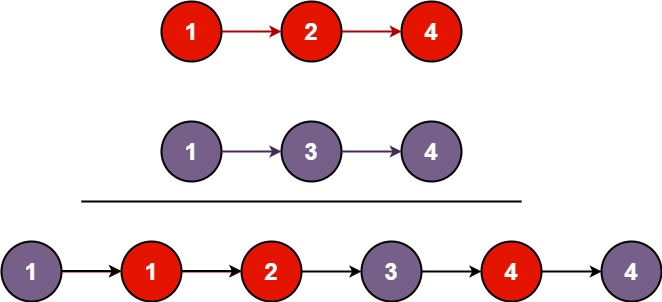
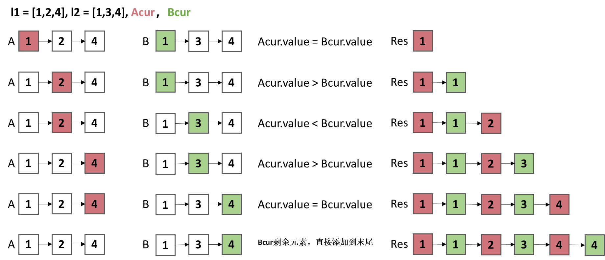

## 合并两个有序链表
将两个升序链表合并为一个新的 升序 链表并返回。新链表是通过拼接给定的两个链表的所有节点组成的。
## 示例



```
示例1：
输入：l1 = [1,2,4], l2 = [1,3,4]
输出：[1,1,2,3,4,4]

示例 2：
输入：l1 = [], l2 = []
输出：[]

示例 3：
输入：l1 = [], l2 = [0]
输出：[0]
```

## 解题思路--双指针
1. 定义两个指针`ACur`和`BCur`，分别指向两个链表的头节点。
2. 比较两个指针的`value`，如果`ACur.value < BCur.value`，则将`ACur`的值赋给新链表的下一个节点，然后`ACur=ACur.next`。


### 算法推导




### 伪代码
```
class Solution {
    public ListNode mergeTwoLists(ListNode list1, ListNode list2) {
        ListNode Acur = list1; 
        ListNode Bcur = list2;
        // 初始化新链表的头节点
        ListNode head = new ListNode(0); 
        ListNode Res = head;
        
        // 比较元素
        while(Acur != null && Bcur != null){
            if(Acur.val <= Bcur.val){
                Res.next = Acur;
                Acur = Acur.next;
            }else{
                Res.next = Bcur;
                Bcur = Bcur.next;
            } 
            Res = Res.next;   // 新链表向后移动
        }
        
        // 剩余节点直接添加到Res末尾
        if(Acur != null){
            Res.next = Acur;
        }
        if(Bcur != null){
            Res.next = Bcur;
        }
        
        return head.next;
    }
}
```


### 复杂度、
- 时间复杂度：`O(max(m,n))`，其中 `m` 和 `n` 分别是两个链表的长度。
- 空间复杂度：`O(1)`。


### Code
```JAVA
class Solution {
    public ListNode mergeTwoLists(ListNode list1, ListNode list2) {
        ListNode Acur = list1; 
        ListNode Bcur = list2;
        // 初始化新链表的头节点
        ListNode head = new ListNode(0); 
        ListNode Res = head;
        
        // 比较元素
        while(Acur != null && Bcur != null){
            if(Acur.val <= Bcur.val){
                Res.next = Acur;
                Acur = Acur.next;
            }else{
                Res.next = Bcur;
                Bcur = Bcur.next;
            } 
            Res = Res.next;   // 新链表向后移动
        }
        
        // 剩余节点直接添加到Res末尾
        if(Acur != null){
            Res.next = Acur;
        }
        if(Bcur != null){
            Res.next = Bcur;
        }
        
        return head.next;
    }
}
```