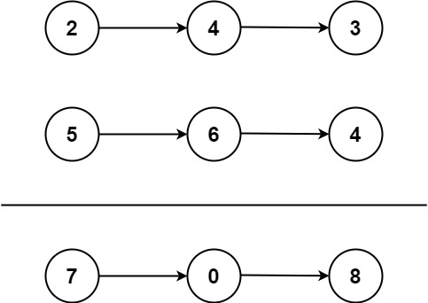
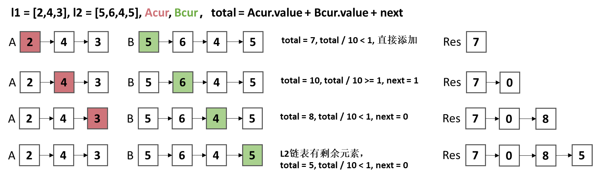

## 两数相加
给你两个 **非空** 的链表，表示两个非负的整数。它们每位数字都是按照 逆序 的方式存储的，并且每个节点只能存储 一位 数字。

请你将两个数相加，并以相同形式返回一个表示和的链表。

你可以假设除了数字 0 之外，这两个数都不会以 0 开头。

## 示例



```
示例1：
输入：l1 = [2,4,3], l2 = [5,6,4]
输出：[7,0,8]
解释：342 + 465 = 807.

示例 2：
输入：l1 = [0], l2 = [0]
输出：[0]

示例 3：
输入：l1 = [9,9,9,9,9,9,9], l2 = [9,9,9,9]
输出：[8,9,9,9,0,0,0,1]
```


## 解题思路--双指针
1. 定义两个双指针，`p1`和`p2`，分别指向两个链表的头节点。
2. `total = p1 + p2 + next`。
    - 如果`total / 10 < 1`，不需要进一位，`next = 0`，将`total % 10`加到`res`上。
    - 如果`total / 10 >= 1`，需要进一位，`next = 1`，将`total % 10`加到`res`上。
3. 最后，如果其中一个链表还有剩余元素，同样计算`total = p +next`，进行判断。

### 算法推导



### 伪代码
```
function addTwoNumbers(l1, l2):
    # 初始化
    total = 0
    next1 = 0

    # 创建结果链表Res
    result = new ListNode()
    current = result

    # 遍历l1和l2。
    while (l1 not None and l2 not None):
        total = l1.val + l2.val + next1   # 计算total
        next1 = total / 10 >= 1 ? 1 : 0    # 判断是否需要进一位
        current.next = new ListNode(total % 10)  # 添加到Res
        # 移动指针
        l1 = l1.next
        l2 = l2.next
        current = current.next

    # 其中一个链表有多余元素。
    while (l1 not None):
        total = l1.val + next1
        next1 = total / 10 >= 1 ? 1 : 0
        current.next = new ListNode(total % 10)
        l1 = l1.next
        current = current.next

    while (l2 not None):
        total = l2.val + next1
        next1 = total/10 >= 1 ? 1 : 0;
        current.next = new ListNode(total % 10)
        l2 = l2.next
        current = current.next

    # 如果最后以为需要进一位，添加到Res。
    if (next1 > 0):
        current.next = new ListNode(next1)

    # 返回结果
    return result.next
```
### 复杂度分析
- 时间复杂度：O(max(m,n))，其中 m 和 n 分别是两个链表的长度。
- 空间复杂度：O(max(m,n))，其中 m 和 n 分别是两个链表的长度。


### Code

```java
class Solution {
    public ListNode addTwoNumbers(ListNode l1, ListNode l2) {
        int total = 0;   // 两数之和
        int next1 = 0;   // 进一位的数值
        ListNode result = new ListNode();
        
        ListNode cur = result;    // 辅助指针
        while (l1 != null || l2 != null) {
            int val1 = l1 == null ? 0 : l1.val;
            int val2 = l2 == null ? 0 : l2.val;
            total = val1 + val2 + next1;
            next1 = total / 10;
            cur.next = new ListNode(total % 10);
            cur = cur.next;
            l1 = l1 == null ? l1 : l1.next;
            l2 = l2 == null ? l2 : l2.next;
        }
        
        if (next1 > 0) {
            cur.next = new ListNode(next1);
        }
        
        return result.next;  
    }
}


```