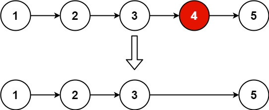
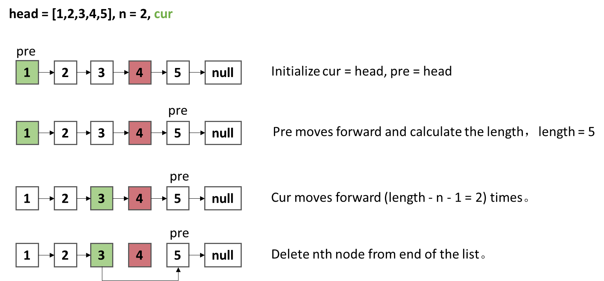
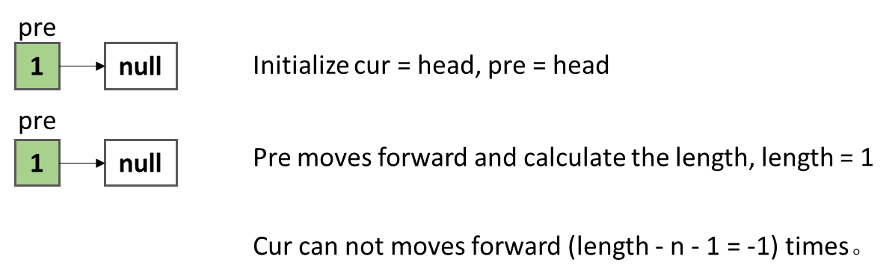
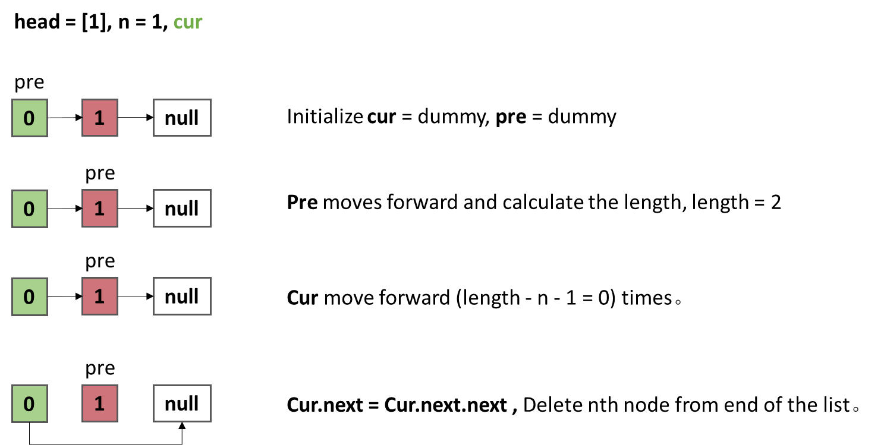
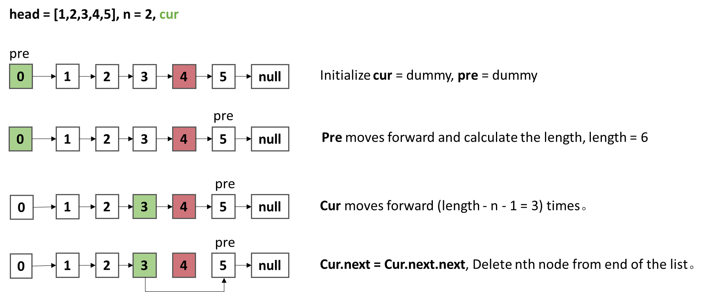
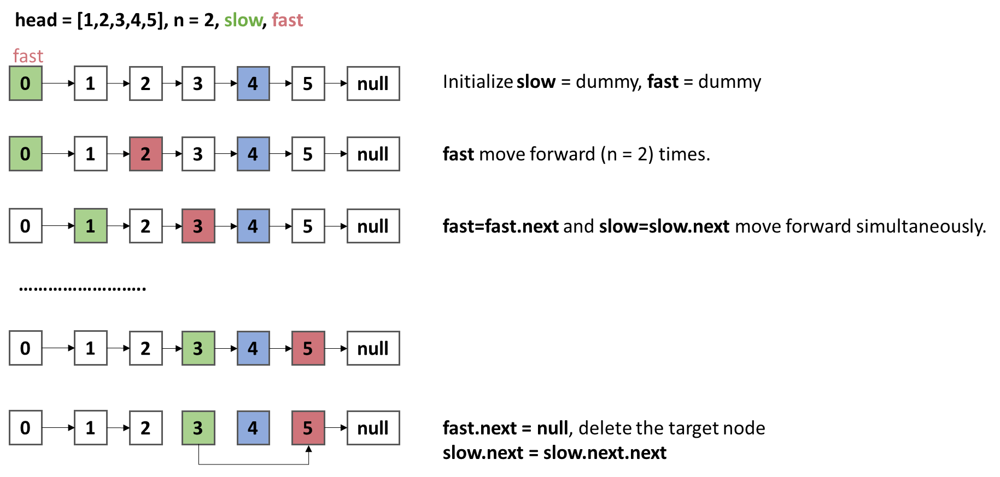
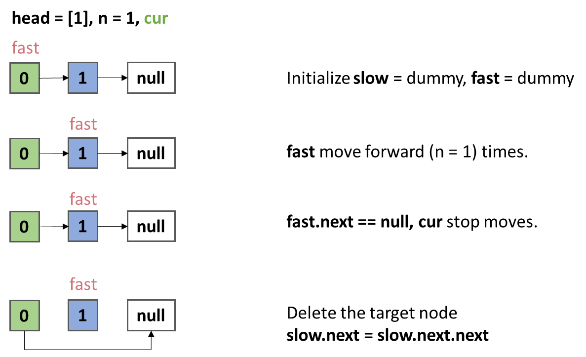

## Remove Nth Node From End of List

Given the head of a linked list,
remove the nth node from the end of the list and return its head.

## Examples



```
Example 1:
Input: head = [1,2,3,4,5], n = 2
Output: [1,2,3,5]

Example 2:
Input: head = [1], n = 1
Output: []

Example 3:
Input: head = [1,2], n = 1
Output: [1]
```

## Ideas -- Calculate the length of list.

1. The problem asks us to delete the last `n` of the singly linked list and return the updated list.
2. Initialize pointer `pre` to find the length of the list.
3. `cur` to start traversing the list from the beginning till we reach the desired index.

### Algorithm Derivation



As the above diagram shows, we can solve the problem successfully.

**But there is an example we need to pay attention to.**



`cur` can not forward to the next node, because it is the last node.

So, the solution is to add a dummy node at the beginning of the list.





### Pseudocode

```
function removeNthFromEnd(head, n):
    # Record length of list
    int len = 1

    # Create dummy node
    dummy = Node(0)
    dummy.next = head
    pre = dummy
    cur = dummy

    # Calculate length of list
    While pre.next is NOT NULL:
        len++
        pre = pre.next

    # Cur moves forward (len - n - 1) times
    For i from 0 to len - n - 1:
        cur = cur.next

    # Delete nth node from end of list
    cur.next = cur.next.next

    # Return the updated list
    return dummy.next
```

### Complexity

- Time Complexity: O(n)
    - `n` is the length of the list.
- Space Complexity: O(1)

| Metric         | Value    | Rank        | Comparison Group       |
|----------------|----------|-------------|------------------------|
| Execution Time | 0 ms     | Top 100.00% | Among users using Java |
| Memory Usage   | 40.74 MB | Top 27.56%  | Among users using Java |

### Code

```java
class Solution {
    public ListNode removeNthFromEnd(ListNode head, int n) {
        // Record length of list.
        int len = 1;

        // Create dummy node.
        ListNode dummy = new ListNode(0);
        dummy.next = head;
        ListNode pre = dummy;
        ListNode cur = dummy;

        // Calculate length of list.
        while (pre.next != null) {
            pre = pre.next;
            len++;
        }

        // cur moves forward (len - n - 1) times.
        for (int i = 0; i < len - n - 1; i++) {
            cur = cur.next;
        }

        // Delete nth node from end of list.
        cur.next = cur.next.next;

        // Return the updated list.
        return dummy.next;
    }
}
```

***

## Ideas -- Double Pointers

1. The another way to solve this problem is to use two pointers.
2. Initialize two pointers `slow` and `fast` to the head of the list.

### Algorithm Derivation





### Pseudocode

```
function removeNthFromEnd(head, n):
    # Create dummy node
    ListNode dummy = new ListNode(0);
    dummy.next = head;

    # fast and slow pointer initialization
    fast = dummy
    slow = dummy

    # Moving fast pointer forward n times
    For i from 0 to n - 1:
        fast = fast.next
    End For

    # Simultaneous movement of fast and slow pointers
    While fast.next is NOT NULL:
        fast = fast.next
        slow = slow.next
    End While

    # Deletion of the nth node from the end
    slow.next = slow.next.next

    # Returning the updated list.
    Return dummy.next
```

### Complexity

- Time Complexity: O(n)
- Space Complexity: O(1)

| Metric         | Value    | Rank        | Comparison Group       |
|----------------|----------|-------------|------------------------|
| Execution Time | 0 ms     | Top 100.00% | Among users using Java |
| Memory Usage   | 40.80 MB | Top 14.37%  | Among users using Java |

### Code

```java
class Solution {
    public ListNode removeNthFromEnd(ListNode head, int n) {
        // Create dummy node.
        ListNode dummy = new ListNode(0);
        dummy.next = head;

        // fast and slow pointer
        ListNode fast = dummy;
        ListNode slow = dummy;

        // fast move forward n times.
        for (int i = 0; i < n; i++) {
            fast = fast.next;
        }

        // fast and slow move forward simultaneously.
        while (fast.next != null) {
            fast = fast.next;
            slow = slow.next;
        }

        // Delete nth node from end of list.
        slow.next = slow.next.next;

        // Return the updated list.
        return dummy.next;
    }
}
```

