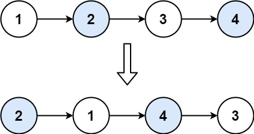
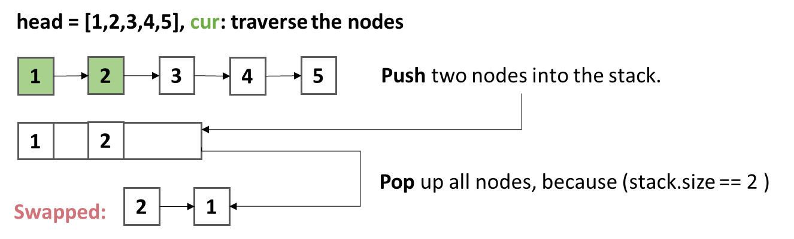
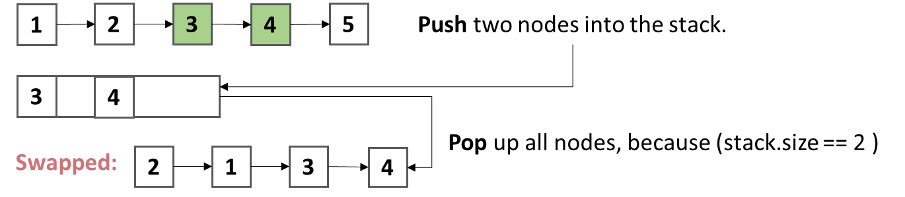
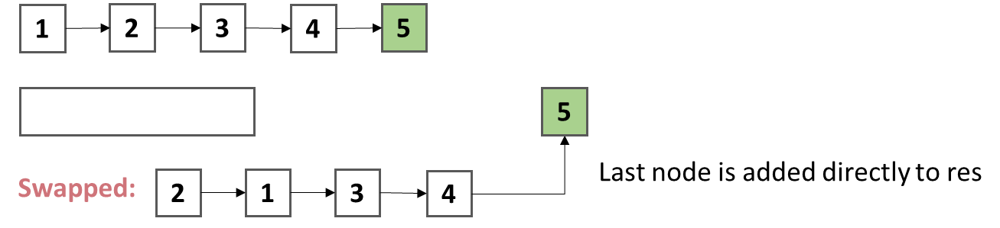

## Swap Nodes in Pairs
[Question Link](https://leetcode.cn/problems/swap-nodes-in-pairs/description/?envType=study-plan-v2&envId=top-100-liked)

Given a linked list, swap every two adjacent nodes and return its head. 

You must solve the problem without modifying the values in the list's nodes (i.e., only nodes themselves may be changed.)

## Examples



```
Example1:
Input: head = [1,2,3,4]
Output: [2,1,4,3]

Example 2:
Input: head = []
Output: []

Example 3:
Input: head = [1]
Output: [1]
```

## Ideas -- Double Pointer
1. Traverse two nodes, and push them into a stack.
2. While the size of the stack equals 2, pop up the nodes a new linked-list(`Result`).
3. When traversing to the last node, it is added to the `Result` directly.

### Algorithm Derivation
1. while `stack.size == 2`, pop up two nodes to `Result` from the stack.

    

    

2. While `cur.next == null`, the last node is added directly to `Result`.

   


### Pseudocode
```
function swapPairs(head):
    if(head == null || head.next == null) return head

    stack = Stack()
    res = ListNode(0)
    cur = head
    tmp = res

    while(cur != null && cur.next != null)
      //Push into stack.
      stack.push(cur);
      stack.push(cur.next)
      cur = cur.next.next

      //Pop up all nodes.
      tmp.next = stack.pop()
      tmp = tmp.next
      tmp.next = stack.pop()
      tmp = tmp.next
    
    
    //Last node
    tmp.next = cur

    //Return 
    return res.next
```

### Complexity
- Time Complexity: O(n)
- Space Complexity: O(n)


Here is the converted text in a table format:

| Metric | Value | Rank | Comparison Group |
|---|---|---|---|
| Execution Time | 0 ms | Top 100.00% | Among users using Java |
| Memory Usage | 40.30 MB | Top 25.22% | Among users using Java |

### Code
```java
class Solution {
    public ListNode swapPairs(ListNode head) {
        if(head==null || head.next==null){
            return head;
        }

        Deque<ListNode> stack = new ArrayDeque();
        ListNode res = new ListNode(0);

        ListNode cur = head;
        ListNode tmp = res;

        while(cur != null && cur.next != null){
            //Push into stack.
            stack.push(cur);
            stack.push(cur.next);
            cur = cur.next.next;

            //Pop up all nodes.
            tmp.next = stack.pop();
            tmp = tmp.next;
            tmp.next = stack.pop();
            tmp = tmp.next;
        }

        //Last node
        tmp.next = cur;

        //Return 
        return res.next; 
    }
}
```

