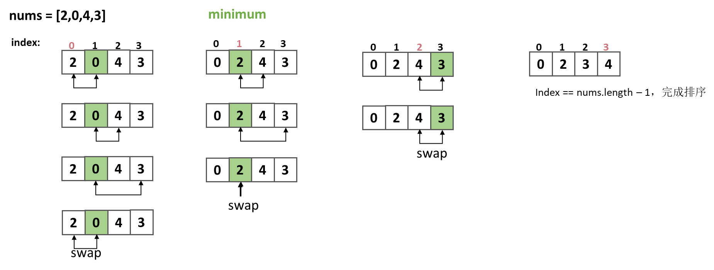

## 选择排序

###  算法推导
1. 选择起始索引第一个元素最为最小值`min`。
2. 然后将`min`与后面的元素比较，直到找到最小元素为止。
3. 交换`index`和`min`的位置。
4. 继续遍历剩下元素，重复上述步骤。



### 伪代码
```
void selectSort(int[] nums) {
    int minimum;
    for (int index = 0; index < nums.length - 1; index++) {
        minimum = index;
        for (int i = index + 1; i < nums.length; i++) {
            if (nums[i] < nums[minimum]) {
                minimum = i;
            }
        }
        // 交换元素
        int tmp = nums[index];
        nums[index] = nums[minimum];
        nums[minimum] = tmp;
    }
}
```
### 复杂度
- 时间复杂度：O(n^2)
- 空间复杂度：O(1)


### Code

```java
class Solution{
    public void selectSort(int[] nums) {
        int minimum;
        for (int index = 0; index < nums.length - 1; index++) {
            minimum = index;
            for (int i = index + 1; i < nums.length; i++) {
                if (nums[i] < nums[minimum]) {
                    minimum = i;
                }
            }
            // 交换元素
            int tmp = nums[index];
            nums[index] = nums[minimum];
            nums[minimum] = tmp;
        }
    }
}
```