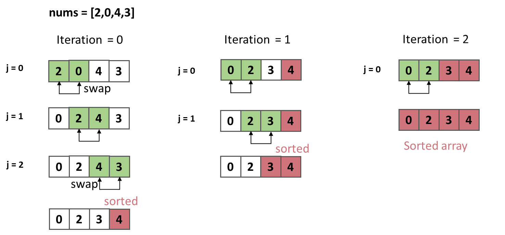

## 冒泡排序

### 算法推导
1. 遍历数组，将最大的元素移动到最右边。



### 伪代码
1. 使用双重循环。
2. 外层迭代次数 = `数组长度 - 1 ` = ` Iteration`。
3. 内层迭代次数 = `数组长度 - 1 - Iteration`。
```
Iteration = nums.length - 1;
for(int i = 0; i < Iteration; i++){
    for(int j = 0; j < Iteration - i; j++){
        //交换元素
        if(nums[j] > nums[j + 1]){
            int tmp = nums[j];
            nums[j] = nums[j + 1];
            nums[j + 1] = tmp;
        }
    }
}
```
### 复杂度
1. 时间复杂度：O(n^2)。
2. 空间复杂度：O(1)。

### Code
```java
class Solution {
    public void bubbleSort(int[] nums) {
        int Iteration = nums.length - 1;
        for(int i = 0; i < Iteration; i++){
            for(int j = 0; j < Iteration - i; j++){
                if(nums[j] > nums[j + 1]){
                    int tmp = nums[j];
                    nums[j] = nums[j + 1];
                    nums[j + 1] = tmp;
                }
            }
        }
    }
}
```


